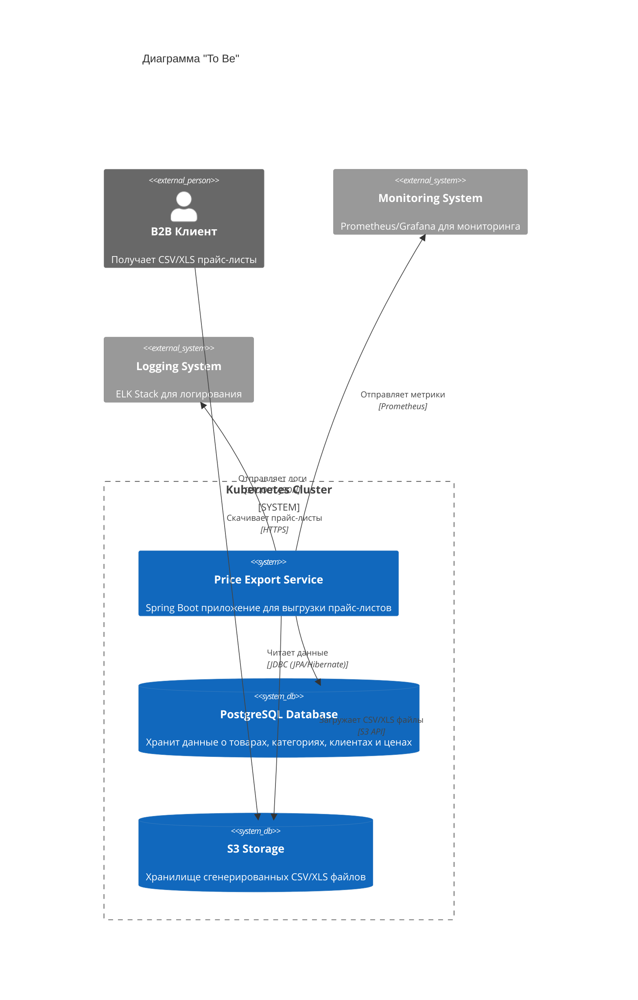

# Задание 2. Разработка дизайна модуля пакетной обработки данных

## Таблица сравнения

| Критерий | Spring Batch | Apache Airflow | K8s Job/CronJob | Spark |
| :--- | :--- | :--- | :--- | :--- |
| **Наличие конфигурации CRON-расписания** | ✅ Да (через @Scheduled или K8s CronJob) | ✅ Да (встроенный scheduler) | ✅ Да (нативный CronJob) | ⚠️ Ограничено (через Airflow/Oozie) |
| **Сложность реализации логики по обработке данных** | ⚠️ Средняя (требует изучения фреймворка) | ✅ Низкая (Python, простые DAG) | ✅ Низкая (простой скрипт) | ❌ Высокая (оверкилл для задачи) |
| **Ресурсоёмкость решения** | ✅ Низкая (легковесный JVM процесс) | ❌ Высокая (требует Airflow + БД + воркеры) | ✅ Минимальная (только pod на время выполнения) | ❌ Очень высокая (требует кластер) |
| **Масштабируемость под нагрузкой** | ✅ Хорошая (горизонтальное масштабирование pod) | ✅ Отличная (распределенное выполнение) | ✅ Отличная (нативное K8s масштабирование) | ✅ Отличная (распределенные вычисления) |
| **Сложность развертывания в облаке** | ✅ Низкая (Docker + K8s, родная интеграция) | ⚠️ Средняя (требует отдельную инфраструктуру) | ✅ Минимальная (нативный K8s ресурс) | ❌ Высокая (требует Spark кластер) |
| **Интеграция с микросервисной архитектурой** | ✅ Отличная (Spring Boot микросервис) | ⚠️ Средняя (внешний оркестратор) | ✅ Отличная (нативный K8s подход) | ❌ Плохая (отдельная экосистема) |
| **Интеграция с логированием и мониторингом** | ✅ Отличная (Spring Actuator, Prometheus) | ✅ Хорошая (встроенный UI, метрики) | ✅ Хорошая (K8s logs, Prometheus) | ✅ Хорошая (Spark UI, метрики) |

## Вывод и обоснование выбора

### Рекомендуемое решение: **Kubernetes CronJob**

**Обоснование:**

1. **Простота задачи**:
    - Требуется только выгрузка данных (SELECT + CSV export)
    - Объем данных небольшой (5-10k строк)
    - Нет сложной трансформации или обработки

2. **Соответствие инфраструктуре**:
    - Уже есть микросервисы в Kubernetes
    - Не требует дополнительных компонентов (как Airflow)
    - Нативная интеграция с облачной средой

3. **Ресурсоэффективность**:
    - Pod запускается только в 6:00 и завершается после выполнения
    - Не требует постоянно работающих воркеров
    - Минимальное потребление ресурсов

4. **Масштабируемость**:
    - При росте нагрузки можно увеличить ресурсы pod
    - Можно распараллелить выгрузку по клиентам
    - K8s автоматически управляет перезапусками

### Почему не другие варианты:

- **Apache Airflow** — избыточен для одной простой задачи, требует поддержки отдельной инфраструктуры
- **Spark** — оверкилл для 10k строк, требует кластера и сложной настройки
- **Только Spring Batch** — хорош, но требует K8s CronJob для запуска по расписанию в любом случае

---

## C4 Context Diagram (To Be)

### Описание работы решения:

1. **Расписание**: Kubernetes CronJob запускает pod в 6:00 каждое утро
2. **Извлечение данных**: Spring Boot приложение подключается к PostgreSQL и выполняет JOIN запрос по таблицам (products, categories, clients, client_prices)
3. **Генерация файлов**: Для каждого B2B клиента генерируется индивидуальный CSV/XLS файл с персональными ценами
4. **Загрузка в хранилище**: Файлы загружаются в S3 bucket с путем `/pricelists/{date}/{client_id}.csv`
5. **Доступ клиентов**: B2B клиенты скачивают файлы через HTTPS (через CDN или прямой доступ к S3)
6. **Мониторинг**: Метрики и логи отправляются в централизованные системы
