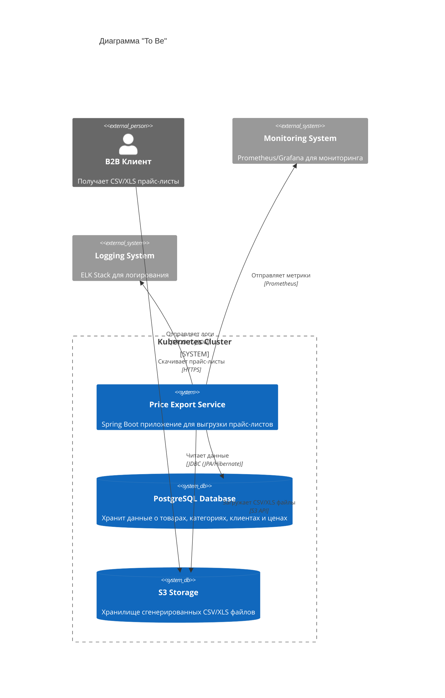

```mermaid
C4Context
    title Диаграмма "To Be"

    Person_Ext(b2b_client, "B2B Клиент", "Получает CSV/XLS прайс-листы")
    
    System_Boundary(k8s, "Kubernetes Cluster") {
        System(price_export_service, "Price Export Service", "Spring Boot приложение для выгрузки прайс-листов", $tags="batch")
        
        SystemDb(postgres, "PostgreSQL Database", "Хранит данные о товарах, категориях, клиентах и ценах", $tags="database")
        
        SystemDb(s3, "S3 Storage", "Хранилище сгенерированных CSV/XLS файлов", $tags="storage")
    }

    System_Ext(monitoring, "Monitoring System", "Prometheus/Grafana для мониторинга", $tags="monitoring")
    System_Ext(logging, "Logging System", "ELK Stack для логирования", $tags="logging")

    Rel(b2b_client, s3, "Скачивает прайс-листы", "HTTPS")
    Rel(price_export_service, postgres, "Читает данные", "JDBC (JPA/Hibernate)")
    Rel(price_export_service, s3, "Загружает CSV/XLS файлы", "S3 API")
    Rel(price_export_service, monitoring, "Отправляет метрики", "Prometheus")
    Rel(price_export_service, logging, "Отправляет логи", "STDOUT/JSON")

    UpdateRelStyle(b2b_client, s3, $offsetY="-40")
    UpdateRelStyle(price_export_service, postgres, $offsetX="-60")
    UpdateRelStyle(price_export_service, s3, $offsetX="60")
    
    UpdateLayoutConfig($c4ShapeInRow="3", $c4BoundaryInRow="1")
```