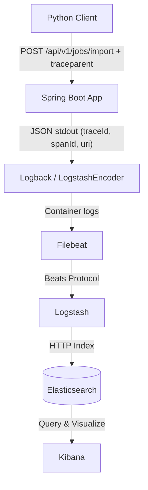

# Настройка трейсинга и логирования запросов

## 1. Выбор технологии трейсинга
**Использовано:** `Micrometer Tracing` + `OpenTelemetry SDK` (`micrometer-tracing-bridge-otel`)

**Обоснование:**
- **Нативная поддержка Spring Boot 3:** Автоматически интегрируется со Spring MVC и Spring Batch без необходимости ручного перехвата запросов или написания фильтров.
- **Стандарт W3C TraceContext:** Генерирует заголовки `traceparent`, полностью совместимые с любыми downstream-системами и инструментами мониторинга.
- **MDC-пропагация:** `traceId` и `spanId` автоматически помещаются в `Mapped Diagnostic Context` (MDC). Благодаря этому `Logback` без дополнительных настроек сериализует их в JSON-лог.
- **Отсутствие дополнительной инфраструктуры:** Для данного задания не требуется разворачивать отдельный Tracing Backend (Tempo/Jaeger/Zipkin). Трейсы инкапсулированы в логи и индексируются в уже существующем ELK-стеке. При необходимости миграции на распределённый трейсинг достаточно добавить OTLP-экспортер без изменения бизнес-кода.

## 2. Архитектура потока данных



## 3. Инструкция по запуску

### 3.1 Инфраструктура и приложение
```bash
cd task-6/initial
docker compose up -d --build
```

### 3.2 Запуск клиента
```bash
cd task-6/client
python3 -m venv venv && source venv/bin/activate
pip install -r requirements.txt
python3 job_client.py
```
**Ожидаемый результат:** `✅ Job completed`, статус `COMPLETED`, в консоли выводится сгенерированный `traceId`.

### 3.3 Проверка в Kibana
1. Откройте `http://localhost:5601` → **Discover**
2. Выберите Index Pattern: `filebeat-*`
3. Примените фильтр: `container.image.name: "batch-processing" AND uri: "/api/v1/jobs/import"`
